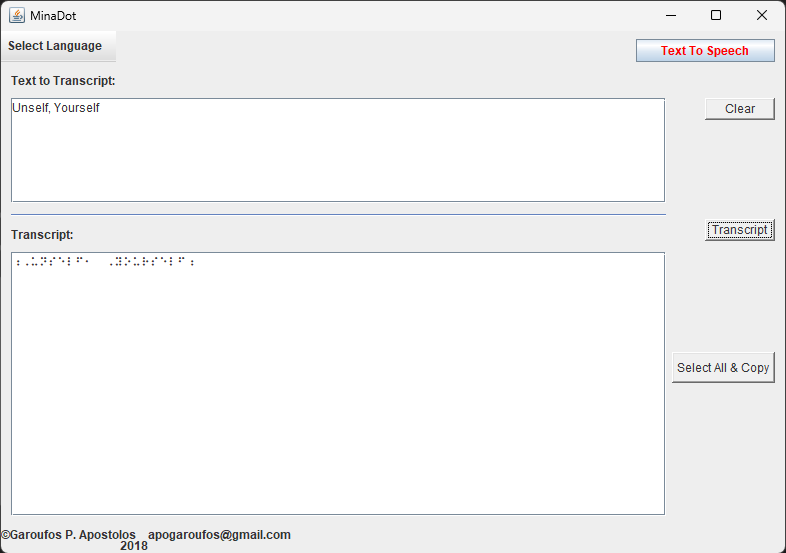

# AgainMina

Μια απλή εφαρμογή Desktop για μετατροπή κειμένου σε Braille

- Δημιουργός της εφαρμογής : ΓΑΡΟΥΦΟΣ Π. ΑΠΟΣΤΟΛΟΣ Υπ. Διδάκτωρ ΔΠΘ (<https://garoufos.edu.gr/>)
- Φιλοξενία : SynergOps (<https://synergops.gr>)

## Σε ποιόν είναι χρήσιμη η εφαρμογή

Σε όποιον επιθυμεί να μετατρέπει Ελληνικό ή Αγγλικό κείμενο σε αντίστοιχο Braille κείμενο

## Πως "τρέχω" την εφαρμογή

Η εφαρμογή είναι γραμμένη σε γλώσσα προγραμματισμού Java. Για να τρέξετε την εφαρμογή θα πρέπει να έχετε εγκαταστήσει την Java στον υπολογιστή σας.

- Κατεβάστε την Java απο την επίσημη ιστοσελίδα της Oracle: <https://www.java.com/en/>
- Αφού ολοκληρώσετε την εγκατάσταση της Java, στην συνέχεια κατεβάστε την εφαρμογή AgainMina : [[Downloads](https://github.com/SynergOps/AgainMina/releases/download/v0.9/AgainMina-v0.9.jar)]
- Κάντε διπλό κλίκ στην εφαρμογή AgainMina-v0.9.jar για να ανοίξει όπως παρακάτω:

 

  

Copyright &copy; [Apostolos P. Garoufos](https://garoufos.edu.gr/)
